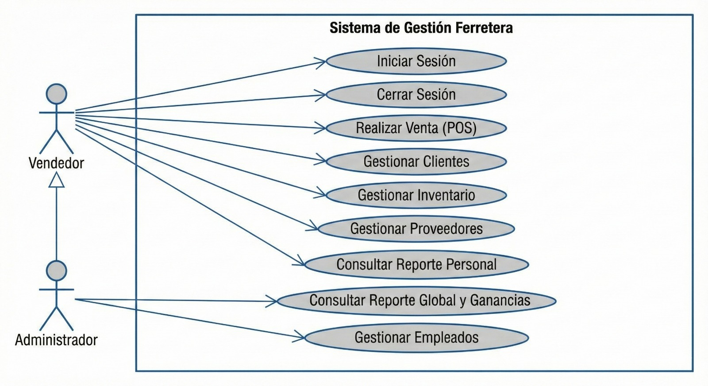
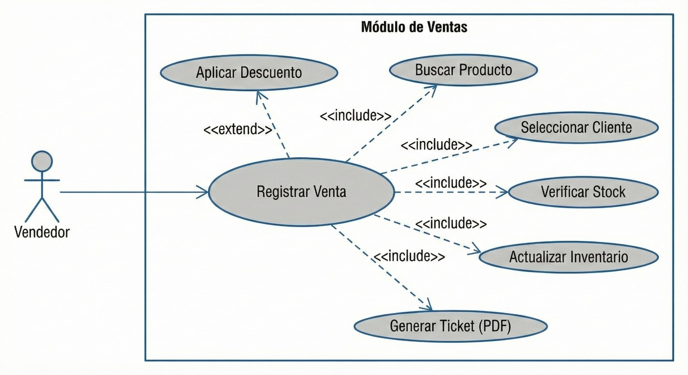

# 🛠️ Sistema de Gestión de Ferretería (Proyecto POO)

El objetivo principal de esta aplicación desarrollada en Java y con arquitectura POO es **optimizar la administración de una ferretería**, proporcionando un control integral sobre inventarios, operaciones comerciales, clientes y reportes.

---

## ⚙️ Requisitos Funcionales y Módulos Clave

El sistema está diseñado en torno a los siguientes módulos funcionales:

### 📦 1. Gestión de Inventarios
Este módulo permite un control preciso sobre todos los productos en stock.
* **Registro Detallado:** Permite registrar nuevos productos con **nombre, descripción, número de artículo, categoría, precio y cantidad disponible**.
* **Actualización Automática:** Los niveles de inventario se actualizan automáticamente al registrar **ventas o compras**.
* **Mantenimiento de Catálogo:** Permite la modificación o eliminación de productos del catálogo.

### 💰 2. Registro de Ventas y Compras
Manejo eficiente de todas las transacciones comerciales.
* **Registro de Ventas:** Registra ventas completas incluyendo fecha, productos vendidos, cantidad, precio y **total**.
* **Órdenes de Compra:** Permite la creación y gestión de **órdenes de compra** a proveedores.
* **Historial Completo:** Mantiene un historial completo de todas las transacciones (ventas y compras).
* **Validación:** **Valida la disponibilidad de inventario** antes de confirmar cualquier venta.

### 🚛 3. Gestión de Proveedores
Centraliza y mantiene actualizada la base de datos de los proveedores.
* **Registro de Datos:** Permite registrar nombre, dirección, teléfono, correo electrónico y productos suministrados.
* **Edición/Eliminación:** Permite editar y eliminar registros de proveedores.
* **Asociación de Productos:** Asocia productos específicos a los proveedores que los suministran.

### 🧾 4. Facturación y Cobro
Automatización de la documentación de venta y procesos de cobro.
* **Generación de Documentos:** Genera automáticamente **recibos o facturas** por cada venta.
* **Cálculo Automático:** Calcula **impuestos, descuentos y totales** de forma automática.
* **Métodos de Pago:** Permite registrar diferentes métodos de pago (**efectivo, tarjeta, transferencia**).

### 🏷️ 5. Descuentos y Promociones
Incorpora flexibilidad para estrategias de precios y fidelización.
* **Aplicación de Descuentos:** Permite aplicar descuentos a **productos específicos** o al **total de la compra**.
* **Administración de Promociones:** Registra y administra promociones temporales.
* **Visualización:** Muestra al cliente el **precio original** y el **precio final con descuento**.

### 🔍 6. Búsqueda y Consulta de Productos
Herramientas de búsqueda rápida para localizar información de inventario.
* **Búsqueda Múltiple:** Permite la búsqueda por **nombre, número de artículo o categoría**.
* **Detalle de Producto:** Muestra información detallada (precio, existencias, descripción y especificaciones técnicas).
* **Filtros Avanzados:** Permite filtros por **disponibilidad, categoría o proveedor**.

### 📈 7. Generación de Reportes
Facilita la toma de decisiones con informes automatizados.
* **Informes de Ventas:** Genera informes de ventas **diarias, semanales, mensuales y anuales**.
* **Reportes de Inventario:** Genera reportes de inventario actualizado.
* **Filtros de Reporte:** Permite elaborar reportes por **categoría de producto o proveedor**.

### 👥 8. Registro de Clientes
Base de datos para seguimiento y fidelización.
* **Registro Completo:** Registra nombre, dirección, contacto e **historial de compras**.
* **Mantenimiento de Datos:** Permite editar y eliminar información del cliente.
* **Consulta Individual:** Permite consultar el **historial de compras individuales**.

---

## 💻 Tecnologías Utilizadas

Este proyecto fue desarrollado utilizando las siguientes herramientas y tecnologías:

* **Lenguaje:** Java 25
* **Gestor de Dependencias:** Apache Maven
* **IDE:** IntelliJ IDEA (Community Edition)
* **Base de Datos:** SQLite (para persistencia local)

---

## 🏗️ Diseño POO: Diagrama de Clases

Esta sección es crucial para entender la arquitectura de **Programación Orientada a Objetos (POO)** del sistema. El diagrama representa las clases principales del proyecto, sus atributos, métodos y las relaciones (asociación, composición, herencia) necesarias para cumplir con los requisitos funcionales de la ferretería.

### Diagrama General del Sistema

---

### 💡 Notas sobre el Diseño POO

Los siguientes principios y estructuras POO se aplicaron en el diseño:

* **Clases Centrales:** El diseño se centra en clases como **Producto**, **Cliente**, **Proveedor** y **Venta**. La clase `Venta` probablemente incluye una relación de **composición** con una clase de detalle (ej: `DetalleVenta`) para manejar los múltiples productos en una sola transacción.
* **Encapsulamiento:** Todos los atributos de las clases tienen modificadores de acceso `private` y se exponen mediante métodos **getters y setters**.
* **Herencia/Interfaces (Opcional):** Se podría haber utilizado **Herencia** para modelar diferentes tipos de productos (ej: `Herramienta`, `MaterialConstrucción`) o **Interfaces** para definir contratos de servicios (ej: `CRUDService`).
* **Gestión de Inventario:** La clase `Producto` interactúa directamente con la lógica de inventario, reflejando el requisito de **actualización automática** de existencias tras una venta o compra.

## 📐 Diseño y Modelado: Diagramas de Caso de Uso

Esta sección presenta los diagramas de Caso de Uso que modelan las interacciones principales de los usuarios (actores) con el Sistema de Gestión de Ferretería.

### 1. Diagrama de Caso de Uso Principal

Este diagrama modela las **funciones de gestión clave** del sistema, incluyendo la administración de productos, transacciones y acceso al sistema.

### 2. Diagrama de Caso de Uso de Operaciones Comerciales

Este diagrama se enfoca en las **operaciones transaccionales y de registro**, como la gestión de ventas, compras y la interacción con clientes y proveedores.

